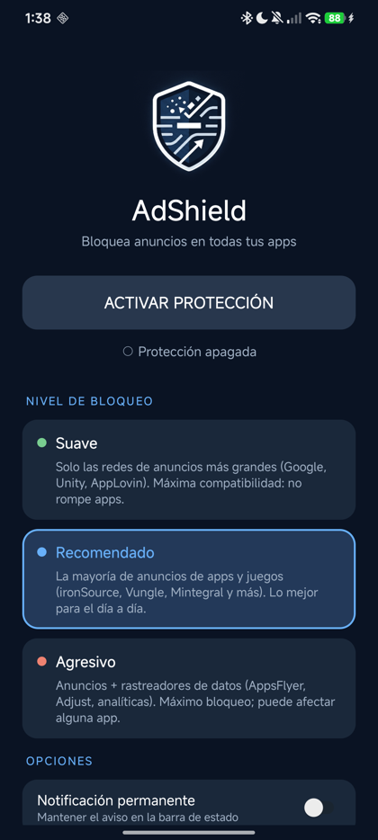

  
  <h1>AdShield</h1>
  
<b>A privacy shield for all your Android apps: fewer trackers, fewer intrusions.</b> 
  <b>Un escudo de privacidad para todas tus apps de Android: menos rastreadores, menos intromisiones.</b>

  
No root · No account · 100% local (your data never leaves your phone) 
  Sin root · Sin cuenta · 100&nbsp;% local (tus datos nunca salen del móvil)

---

> 🇬🇧 **English** below · 🇪🇸 **Español** más abajo

  

---

## 🇬🇧 English

AdShield is a tiny app (~25&nbsp;KB) that runs a **local VPN** (nothing leaves your device)
to **filter DNS** and cut off the domains that **track you and profile you** (analytics, telemetry and ad-network trackers). Because your traffic never goes to any
external server, it's private and lightweight.

### ✨ Features
- **One button** to turn protection on/off.
- **3 blocking levels**, each clearly explaining what it targets.
- **Works in every app**, not just the browser.
- **Optional persistent notification.**
- No weird permissions, no data collection, no root.

### 🛡️ Blocking levels
| Level | Blocks | For whom |
|-------|--------|----------|
| 🟢 **Soft** | Only the biggest ad-network trackers (Google Ads, Unity, AppLovin). | Max compatibility, won't break apps. |
| 🔵 **Recommended** | Most app & game ad trackers (ironSource, Vungle, Mintegral, Criteo…). | Everyday use. |
| 🔴 **Aggressive** | Ad trackers **+ analytics/telemetry** (AppsFlyer, Adjust, Firebase Analytics…). | Max privacy; may affect some app features. |

### 📲 Install
1. Download **`AdShield.apk`** (from [Releases](../../releases) or this repo).
2. Open it and allow *"install from unknown sources"* if asked.
3. Open **AdShield** → **ACTIVAR PROTECCIÓN** → **Allow** the VPN request.
4. Pick a level (**Recommended** for most people).

> A key/VPN icon appears in the status bar while active — that's Android's own indicator
> (shown for any VPN) and can't be removed while the filter is on.

### ⚙️ How it works
- Uses `VpnService` to become the system **DNS server** (a dummy IP routed only for port 53).
  The rest of your traffic does **not** go through the app.
- Each DNS query is inspected: if the domain is on the level's list → replies **NXDOMAIN**
  (the ad won't load); otherwise it's forwarded to your **network's real DNS** (`1.1.1.1`/`8.8.8.8`
  as fallback) and the answer is returned.
- Single thread, `poll()`-based wait → **~0% CPU when idle** (no battery drain).
- Built-in compatibility exception: `events.mz.unity3d.com` is always allowed, so some apps keep working normally.

### 🔧 Build
Open in **Android Studio** and let Gradle sync (downloads AGP/Gradle). Then Run ▶ / `Build > Build APK(s)`.
No external dependencies (Android framework only). `minSdk 26`, `targetSdk 29`.

### 🚫 Not on Google Play
Google Play restricts VPN-style tools that filter *other* apps. That's why AdShield is
distributed via **APK / GitHub**, like AdGuard, Blokada or RethinkDNS.

---

## 🇪🇸 Español

AdShield es una app minúscula (~25&nbsp;KB) que monta una **VPN local** (no sale de tu móvil)
para **filtrar el DNS** y cortar los dominios que **te rastrean y perfilan** (analíticas, telemetría y rastreadores de redes publicitarias). Como tu tráfico no
va a ningún servidor externo, es privada y ligera.

### ✨ Características
- **Un botón** para activar/desactivar.
- **3 niveles de bloqueo**, con explicación clara de qué corta cada uno.
- **Funciona en todas las apps**, no solo el navegador.
- **Notificación permanente opcional.**
- Sin permisos raros, sin recopilar nada, sin root.

### 🛡️ Niveles de bloqueo
| Nivel | Qué bloquea | Para quién |
|-------|-------------|------------|
| 🟢 **Suave** | Solo los rastreadores de las redes grandes (Google Ads, Unity, AppLovin). | Máxima compatibilidad, no rompe apps. |
| 🔵 **Recomendado** | La mayoría de rastreadores de anuncios de apps y juegos (ironSource, Vungle, Mintegral, Criteo…). | El día a día. |
| 🔴 **Agresivo** | Rastreadores de anuncios **+ analíticas/telemetría** (AppsFlyer, Adjust, Firebase Analytics…). | Máxima privacidad; puede afectar alguna app. |

### 📲 Instalación
1. Descarga **`AdShield.apk`** (en [Releases](../../releases) o este repo).
2. Ábrelo y permite *"instalar de orígenes desconocidos"* si te lo pide.
3. Abre **AdShield** → **ACTIVAR PROTECCIÓN** → **Aceptar** la solicitud de VPN.
4. Elige un nivel (**Recomendado** para la mayoría).

> Al activarse verás un icono de llave/VPN en la barra de estado: es de Android (aparece con
> cualquier VPN) y no se puede quitar mientras el filtro esté activo.

### ⚙️ Cómo funciona
- Usa `VpnService` para declararse **servidor DNS** del sistema (una IP ficticia enrutada solo
  para el puerto 53). El resto del tráfico **no** pasa por la app.
- Cada consulta DNS se revisa: si el dominio está en la lista del nivel → responde **NXDOMAIN**
  (el anuncio no carga); si no → la reenvía al **DNS real de tu red** (`1.1.1.1`/`8.8.8.8` de
  respaldo) y devuelve la respuesta.
- Un solo hilo, espera con `poll()` → **~0&nbsp;% de CPU en reposo** (no gasta batería).
- Excepción de compatibilidad: `events.mz.unity3d.com` se permite siempre, para que algunas apps sigan funcionando con normalidad.

### 🔧 Compilar
Ábrelo en **Android Studio** y deja que sincronice Gradle. Luego Run ▶ / `Build > Build APK(s)`.
Sin dependencias externas (solo el framework de Android). `minSdk 26`, `targetSdk 29`.

### 🚫 No en Google Play
Google Play restringe las herramientas tipo VPN que filtran *otras* apps. Por eso se
distribuye por **APK / GitHub**, igual que AdGuard, Blokada o RethinkDNS.

---

## ⚠️ Disclaimer / Aviso
Personal tool, no warranty. Blocking ads can affect developers' revenue and, in some cases, an
app's functionality. Use responsibly. · Herramienta personal, sin garantías. Úsalo con criterio.

## 📄 License / Licencia
[MIT](LICENSE)
